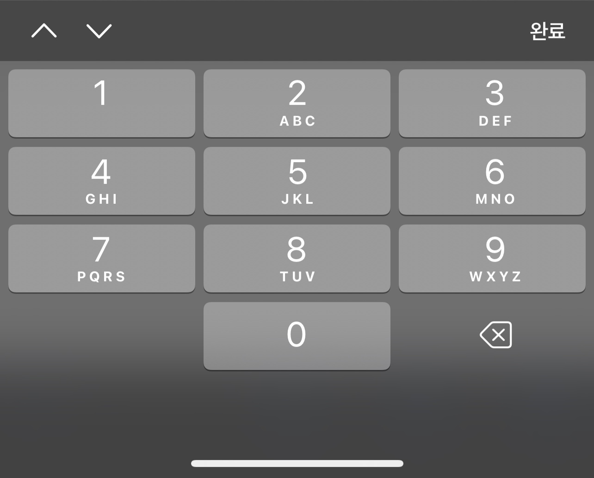

# input number 숫자 키패드로 전환하는 방법

ios 모바일 브라우저에서 input number 사용시\
글자와, 숫자키패드가 포함된 키패드가 올라오는것을 볼수 있는데,\
가끔 숫자 키패드만 사용하고 싶을때(유저에게  제공)가 있다.\
\*\* 안드로이드는 number 사용시 자동으로 숫자만 나오는 키패드가 뜸

input 자체 속성으로 ios에서 숫자키패드만 띄우는게 가능하다.



이런 모양으로 숫자만 나오게하는 방법

```html
<input
  type="number"
  pattern="[0-9]*"
  inputmode="numeric"
/>
```

pattern과 inputmode를 사용하면 숫자 키패드를 사용할 수 있다.
